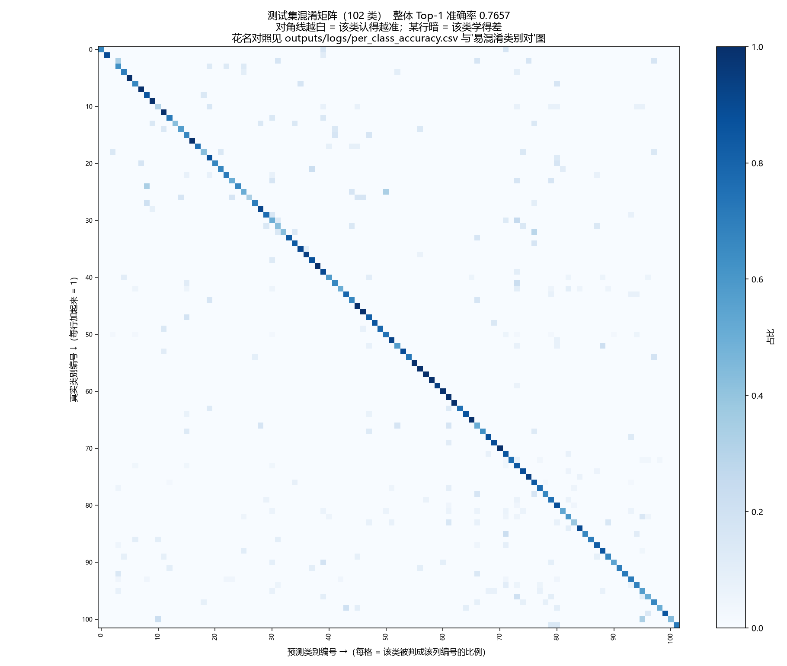
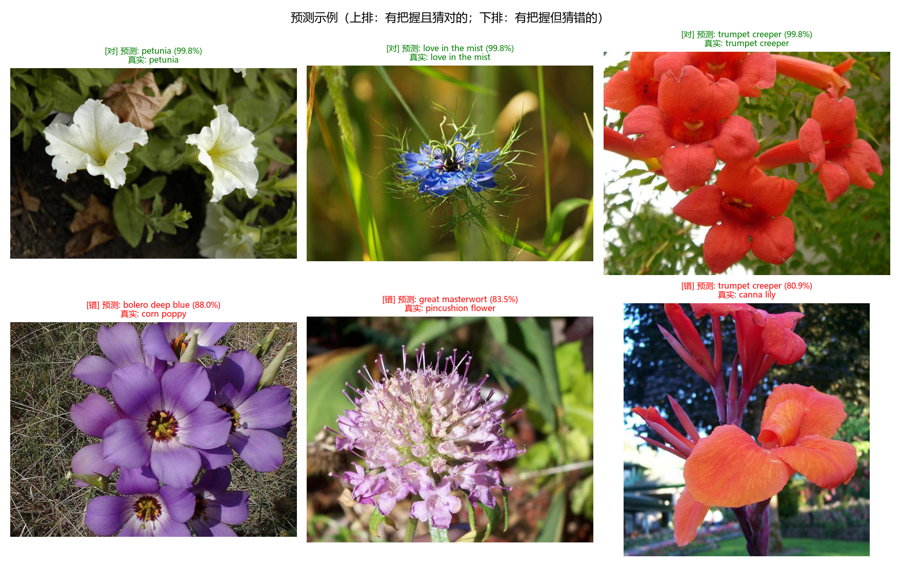

# 基于手写 ResNet 的花卉图像分类

灵境竞赛组后端 AI 方向第一阶段考核任务。

使用 PyTorch 从零手写 ResNet 残差网络，完成 Oxford 102 Flowers 数据集的
102 类花卉图像分类；并通过迁移学习对比实验验证预训练特征的价值。
## 结果

| 模型 | 训练方式 | 轮数 | 测试集 Top-1 | 测试集 Top-5 |
|------|---------|-----|-------------|-------------|
| **手写 ResNet-18** | 从零训练 | 30 | **76.57%** | 94.47% |
| ResNet-18 | 迁移学习 | 5 | **96.26%** | 99.35% |
| 随机猜测基线 | — | — | 0.98% | 4.90% |




## 环境要求

| 项目 | 版本 |
|------|------|
| 操作系统 | Windows 11 |
| Python | 3.12 |
| PyTorch | 2.11.0 + CUDA 12.8 |
| torchvision | 0.26.0 + CUDA 12.8 |
| 显卡 | NVIDIA RTX 5060 Laptop (8GB)，CPU 也可运行但较慢 |

主要依赖：numpy、pandas、matplotlib、scikit-learn、Pillow、scipy、tqdm

### 安装步骤

```bash
# 1. 创建并激活 conda 环境
conda create -n flower python=3.12 -y
conda activate flower

# 2. 安装 PyTorch
# ⚠️ 必须使用 cu128：RTX 50 系显卡（Blackwell 架构）需要 CUDA 12.8 及以上的构建。
#    若直接使用默认源会安装成 cu132 版本，导致 torch.cuda.is_available() 返回 False。
pip install torch==2.11.0 torchvision==0.26.0 --index-url https://download.pytorch.org/whl/cu128

# 3. 安装其余依赖
pip install -r requirements.txt

# 4. 验证环境
python check_env.py
```

第 4 步应输出：

```
CUDA 可用      : True
显卡           : NVIDIA GeForce RTX 5060 Laptop GPU
算力(compute)  : (12, 0)
```

若 `CUDA 可用` 为 `False`，通常是 PyTorch 的 CUDA 版本高于显卡驱动所致。

---


## 使用教程

所有命令均在**项目根目录**下执行。

### 1. 准备数据与统计分析

```bash
# 读取 Oxford 102 Flowers，生成元数据表与类别分布图
python src/data/build_metadata.py

# 分层划分数据集（训练 5731 / 验证 1229 / 测试 1229），
# 并统计本数据集的通道均值与标准差
python src/data/dataset.py
```

> 首次运行会自动下载并解压数据集（约 330MB）。
> 若网络受限，可手动下载 `102flowers.tgz`、`imagelabels.mat`、`setid.mat`
> 放入 `data/flowers-102/` 目录。

### 2. 验证手写 ResNet 结构

```bash
python src/models/resnet.py
```

应输出参数量 `11,228,838`，与 ResNet-18（102 类）理论值一致。

### 3. 训练手写 ResNet

```bash
python train.py --epochs 30
```

约 22 分钟。训练日志与最优权重输出至 `outputs/logs/` 与 `outputs/checkpoints/`。

常用参数：

```bash
python train.py --epochs 2 --batch-size 16    # 快速冒烟测试 / 显存不足时
```

### 4. 测试集评估

```bash
python evaluate.py --ckpt best.pt
```

输出 Top-1 / Top-5 准确率、混淆矩阵、每类准确率、分类报告与预测示例。

### 5. 迁移学习对比实验

```bash
python transfer.py --epochs 5                 # 微调预训练 ResNet-18
python evaluate.py --ckpt transfer_best.pt
```

可选对照：

```bash
python transfer.py --epochs 5 --freeze-backbone   # 仅训练分类头
python transfer.py --epochs 5 --no-pretrained     # 不使用预训练权重
```

### 6. 对新图片进行预测

```bash
# 交互模式：启动后手动输入图片路径，支持连续预测
python predict.py --interactive

# 直接指定单张图片
python predict.py --image path/to/your_flower.jpg

# 批量预测一个文件夹
python predict.py --image path/to/folder/
```

输出 Top-5 预测类别及置信度，并保存可视化结果图。

### 输出产物

| 路径 | 内容 |
|------|------|
| `outputs/metadata.csv` | 数据集元数据表 |
| `outputs/figures/` | 类别分布、混淆矩阵、预测示例等图表 |
| `outputs/logs/` | 训练日志、评估报告、分类报告 |
| `outputs/checkpoints/best.pt` | 手写 ResNet 最优权重 |
| `outputs/checkpoints/transfer_best.pt` | 迁移学习模型最优权重 |

---

## 说明

残差块与 ResNet 网络组装均为自行实现，未调用 `torchvision.models`；
`torchvision` 预训练模型仅用于迁移学习对比实验，作为主模型之外的对照实验。

数据集：[Oxford 102 Flowers](https://www.robots.ox.ac.uk/~vgg/data/flowers/102/)